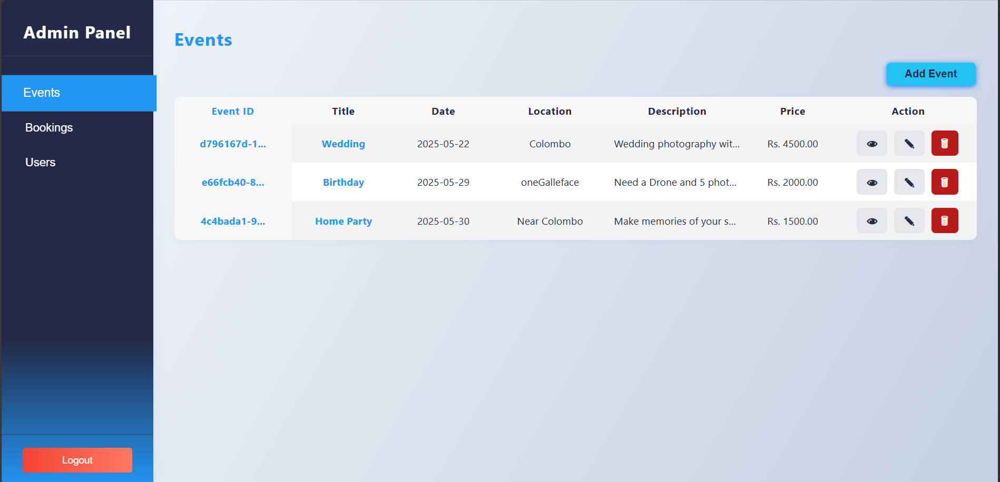
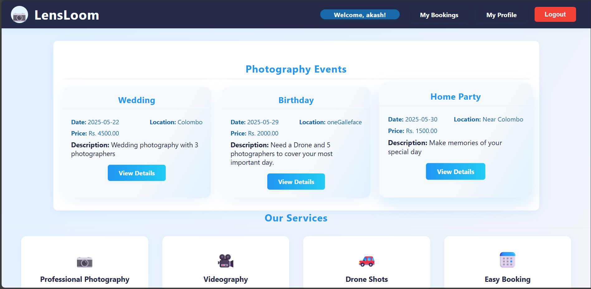
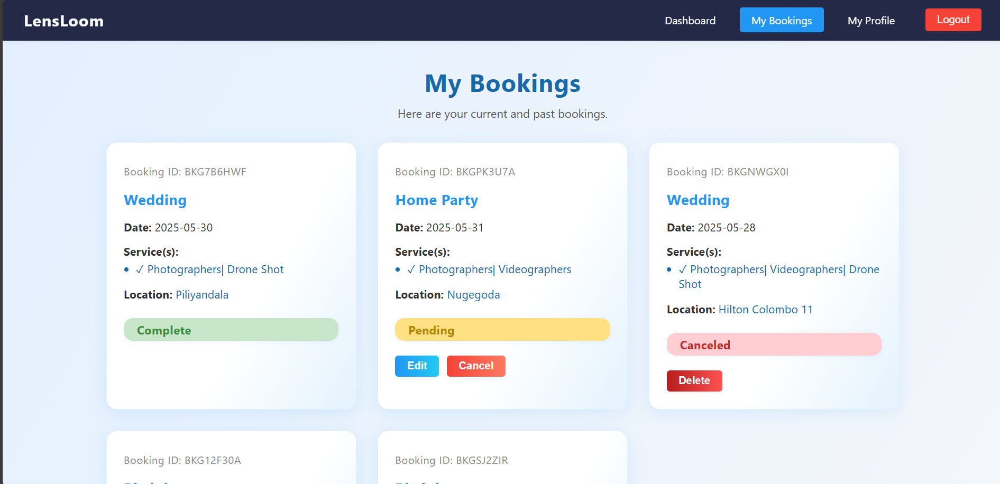
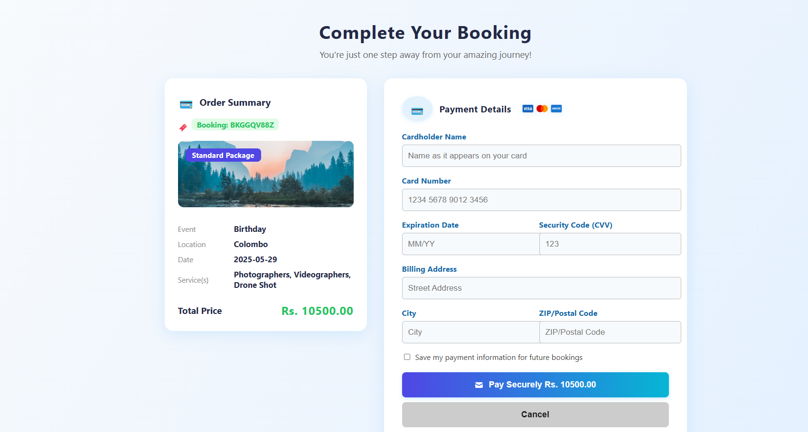

# 📸 Event Booking System

A web-based Event Booking System for managing photography events, bookings, and users. Built with Java (JSP/Servlets), this project allows admins to manage events and users, and customers to book events.

---

## ✨ Features

- **🛠️ Admin Dashboard**
  - ➕ Add, ✏️ edit, 👁️ view, and 🗑️ delete photography events
  - 📋 View all bookings and update their status (⏳ Pending, ✅ Complete, ❌ Canceled)
  - 👤 Manage users (view and delete)
- **🙋 User Functionality**
  - 📝 Register and 🔑 login
  - 🔍 Browse available events
  - 📅 Book events and view booking status
- **💎 Attractive UI**
  - 📱 Responsive and modern design for admin and user dashboards
  - 🪟 Modal popups for event forms and details

---

## 🛠️ Technologies Used

- ☕ Java (JSP, Servlets)
- 🖥️ HTML5, 🎨 CSS3, 📝 JavaScript
- 🗂️ File-based storage for users, events, and bookings
- 🐱‍💻 Tomcat server

---

## 🚀 Getting Started

1. **Clone the repository**
   ```bash
   git clone <your-repo-url>
   ```
2. **Open in your favorite IDE** (e.g., IntelliJ IDEA, Eclipse)
3. **Configure Tomcat server** and set the project as a web application
4. **Build and run the project**
5. **Access the application**
   - 🛡️ Admin: `http://localhost:8080/Event_Booking_System/adminDashboard.jsp`
   - 👤 User: `http://localhost:8080/Event_Booking_System/index.jsp`

---

## 🔑 Default Admin Credentials

- **Username:** `admin`
- **Password:** `admin123`

---

## 📁 Folder Structure

```
Event_Booking_System/
├── src/
│   ├── main/
│   │   ├── java/         # Java source files (Servlets, Models, Utilities)
│   │   └── webapp/       # JSP pages and static resources
│   └── util/             # File handlers for users, bookings, and events
└── README.md
```

---

## 🖼️ Screenshots

 


 

 

 


---

